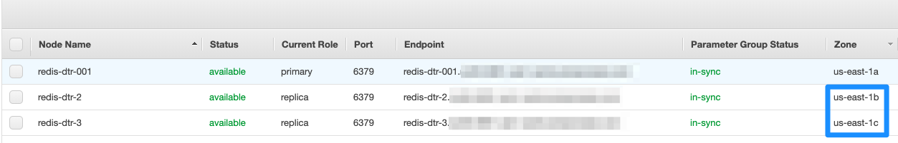
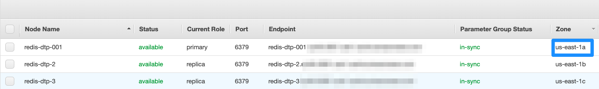
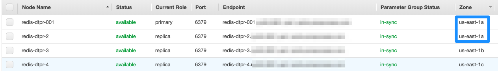
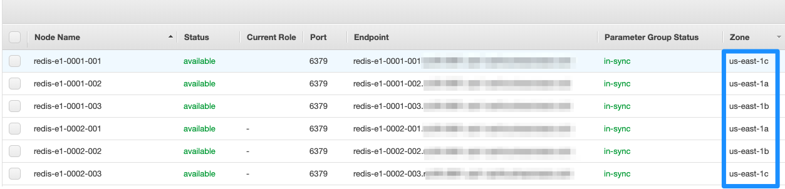

Sample Terraform infrastructure to demonstrate different AWS Elasticache Redis setups.

## Steps

1. Create the state bucket

    ```sh
    cd base/01-state_mgmt
    make init && make plan && make apply
    ```

    Output will be similar to:

    ```sh
    tf_bucket_id = aws-elasticache-state-bucket
    ```

    This will create an AWS S3 versioning enabled state bucket - which will be used as a foundation for storing remote
    state for further infra work. To read more about why to take this approach for creating state bucket, read [this](https://github.com/saurabh-hirani/terraform-aws-state-mgmt).

2. Export the state bucket variable

    ```sh
    export TF_STATE_S3=aws-elasticache-state-bucket
    ```

3. Create the necessary security groups

    ```sh
    cd - && cd base/security_groups
    make init && make plan && make apply
    ```

    Output will be similar to:

    ```sh
    bastion_security_group_id = sg-xxx
    bastion_security_group_name = test-bastion
    admin_security_group_id = sg-yyy
    admin_security_group_name = test-admin
    elasticache_security_group_id = sg-zzz
    elasticache_security_group_name = test-elasticache-redis
    ```

    As AWS Elasticache instances are not public, this creates

    1. A **bastion** security group - which can be applied to your publicly accessible bastion host.
    2. An **admin** security group - which can be applied to your internal admin server accessible **only** from the bastion host.
    3. An **elasticache** security group - which will be applied to the Elasticache cluster which will be accessible **only** from your admin host.

    You may very well skip the bastion and admin security group in case you have a different AWS setup. The important thing to
    note is that the **elasticache** security group will be referrred to as a remote state item when creating the clusters.

4. Create the necessary subnet groups

    ```sh
    cd - && cd base/subnet_groups
    make init && make plan && make apply
    ```

    Output will be similar to:

    ```sh
    name = test-elasticache-redis
    subnet_ids = subnet-xxx,subnet-yyy,subnet-zzz
    ```

    The **subnet_ids** will be referred to as a remote state item when creating the clusters.

5. Create AWS Elasticache Redis with cluster mode disabled targeting the replica node

    ```sh
    cd - && cd redis_cluster_mode_disabled_target_replica
    make init && make plan && make apply
    ```

    Output will be similar to:

    ```sh
    member_clusters = [
      "redis-dtr-001",
    ]
    primary_endpoint_address = redis-dtr.xxxx.amazonaws.com
    replica_1_cache_nodes = [
        {
            "address" = "redis-dtr-2.xxxx.amazonaws.com"
            "availability_zone" = "us-east-1b"
            "id" = "0001"
            "port" = 6379
        },
    ]
    replica_2_cache_nodes = [
        {
            "address" = "redis-dtr-3.xxxx.amazonaws.com"
            "availability_zone" = "us-east-1c"
            "id" = "0001"
            "port" = 6379
        },
    ]
    replication_group_id = redis-dtr
    ```

    dtr == AWS Elasticache cluster mode **d**isabled **t**arget **r**eplica

    This will create AWS Elasticache cluster mode disabled with 2 replicas. If you attack
    **us-east-1b** or **us-east-1c** - you can target either/both replicas.

    

    Once done, run

    ```sh
    make destroy
    ```

    if you want to destroy this setup.

6. Create AWS Elasticache Redis with cluster mode disabled targeting the primary node

    ```sh
    cd - && cd redis_cluster_mode_disabled_target_primary
    make init && make plan && make apply
    ```

    Output will be similar to:

    ```sh
    member_clusters = [
        "redis-dtp-001",
    ]
    primary_endpoint_address = redis-dtp.xxxx.amazonaws.com
    replica_1_cache_nodes = [
        {
            "address" = "redis-dtp-2.xxxx.amazonaws.com"
            "availability_zone" = "us-east-1b"
            "id" = "0001"
            "port" = 6379
        },
    ]
    replica_2_cache_nodes = [
        {
            "address" = "redis-dtp-3.xxxx.amazonaws.com"
            "availability_zone" = "us-east-1c"
            "id" = "0001"
            "port" = 6379
        },
    ]
    replication_group_id = redis-dtp
    ```

    dtp == AWS Elasticache cluster mode **d**isabled **t**arget **p**rimary

    This will create AWS Elasticache cluster mode disabled with 2 replicas. If you attack
    **us-east-1a** - you can target the primary node.

    

    Once done, run

    ```sh
    make destroy
    ```

    if you want to destroy this setup.

7. Create AWS Elasticache Redis with cluster mode disabled targeting the primary and replica node

    ```sh
    cd - && cd redis_cluster_mode_disabled_target_primary_replica
    make init && make plan && make apply
    ```

    Output will be similar to:

    ```sh
    member_clusters = [
    "redis-dtpr-001",
    ]
    primary_endpoint_address = redis-dtpr.xxxx.amazonaws.com
    replica_1_cache_nodes = [
    {
        "address" = "redis-dtpr-2.xxxx.amazonaws.com"
        "availability_zone" = "us-east-1a"
        "id" = "0001"
        "port" = 6379
    },
    ]
    replica_2_cache_nodes = [
    {
        "address" = "redis-dtpr-3.xxxx.amazonaws.com"
        "availability_zone" = "us-east-1b"
        "id" = "0001"
        "port" = 6379
    },
    ]
    replica_3_cache_nodes = [
    {
        "address" = "redis-dtpr-4.xxxx.amazonaws.com"
        "availability_zone" = "us-east-1c"
        "id" = "0001"
        "port" = 6379
    },
    ]
    replication_group_id = redis-dtpr
    ```

    dtpr == AWS Elasticache cluster mode **d**isabled **t**arget **p**rimary and **r**eplica

    This will create AWS Elasticache cluster mode disabled with primary and replica in the same AZ. If you attack
    **us-east-1a** - you can target both the primary and the replica node.

    

    Once done, run

    ```sh
    make destroy
    ```

    if you want to destroy this setup.

8. Create AWS Elasticache Redis with cluster mode enabled setup - 2 shards (0001 and 0002), 3 nodes per shard. We cannot assign AZ
   specifically to primary/replica node as it is decided by AWS at runtime.

    ```sh
    cd - && cd redis_cluster_mode_enabled_setup_1
    make init && make plan && make apply
    ```

    Output will be similar to:

    ```sh
    configuration_endpoint_address = redis-e1.xxxx.amazonaws.com
    member_clusters = [
        "redis-e1-0001-001",
        "redis-e1-0001-002",
        "redis-e1-0001-003",
        "redis-e1-0002-001",
        "redis-e1-0002-002",
        "redis-e1-0002-003",
    ]
    primary_endpoint_address = redis-e1.xxxx.amazonaws.com
    replication_group_id = redis-e1
    ```

    

    As you can see - you cannot decide if the node is primary/replica from the console (you could do that in a cluster mode
    disabled setup). AWS API also doesn't give this info. You have to resort to an indirect trick I have described [here](https://stackoverflow.com/questions/42061598/how-can-we-see-which-nodes-are-primary-or-replica-in-aws-elasticache-redis-clus/56560240#56560240) to
    find out AWS Elasticache Redis cluster mode enabled primary and replica nodes per shard.

    Once done, run

    ```sh
    make destroy
    ```

    if you want to destroy this setup.
